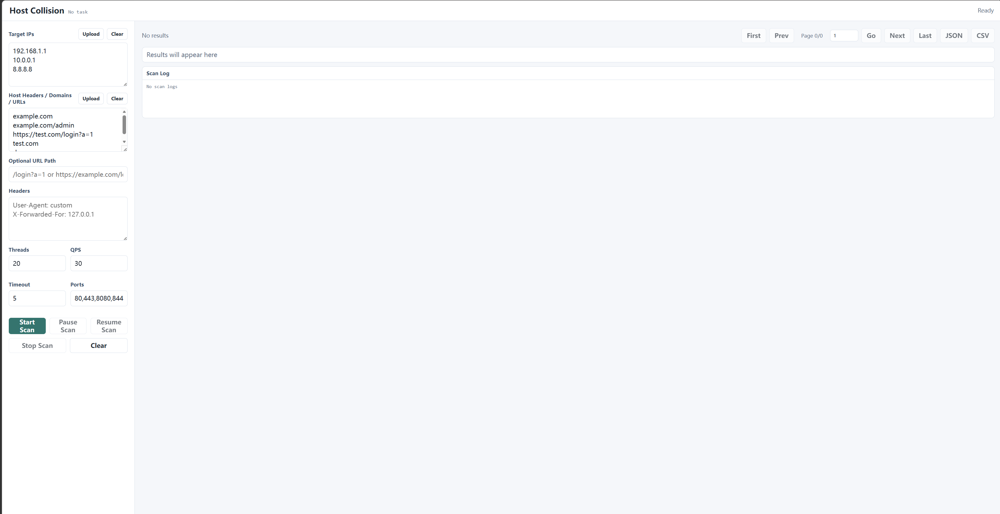

# Host Collision

## 中文说明

Host Collision 是一个 Host Header 碰撞扫描工具。它会连接目标 `IP:Port`，同时设置候选 `Host` 请求头，记录不同 Host Header 下的 HTTP/HTTPS 响应。

### 功能特性

- 扫描模型为 `目标 IP x Host Header/URL x 端口`
- IP 输入支持单 IP、CIDR、范围和通配符
- Host 输入支持域名、域名路径和完整 URL
- Host 输入为 URL 时会保留 path/query
- 支持 `-H "Name: value"` 自定义请求头
- 支持并发线程数和 QPS 控制
- CLI 扫描时流式写入结果文件
- 支持 CSV / JSON 输出
- CLI CSV 扫描支持 checkpoint / resume
- 无状态码且超时的探测不会进入正常结果
- timeout/no-status 探测会写入独立 timeout 日志
- GUI 支持暂停、继续、停止当前扫描、实时结果、表头排序、任务 ID、刷新恢复和每任务 CSV 自动保存
- GUI 结果表使用后端分页查询，浏览器只保留当前页，适合较大结果集
- GUI 模式会写入 `hostcollision-gui.log` 执行日志

### 编译

```bash
go mod download
go build -trimpath -ldflags="-s -w" -o hostcollision ./cmd
```

Windows:

```powershell
go build -trimpath -ldflags="-s -w" -o hostcollision.exe .\cmd
```

### GUI 使用

```bash
hostcollision -g
```

GUI 会启动本地 Web 服务并自动打开浏览器。
默认不启用鉴权。如需给 GUI 启用 Basic Auth：

```bash
hostcollision -g --gui-user admin --gui-password change-me
```

GUI 行为：

- 当前任务 ID 会显示在 `Host Collision` 旁边。
- 浏览器 URL 会自动更新为 `?id=<task-id>`。
- 刷新页面后，只要 GUI 进程仍在运行，就会自动重连该任务。
- 正常结果会边扫边保存到 `hostcollision-gui-<task-id>.csv`。
- 已完成探测会写入 `hostcollision-gui-<task-id>.checkpoint`，用于暂停后继续。
- timeout/no-status 不显示在结果表中，会写入 `timeout.log`。
- 执行日志会写入 `hostcollision-gui.log`。
- `Pause Scan` 会暂停当前 GUI 扫描任务，保留 checkpoint 和已经落盘的 CSV。
- `Resume Scan` 会使用同一个 checkpoint 继续扫描，并追加写入同一个 CSV。
- `Stop Scan` 会停止当前 GUI 扫描任务，已经落盘的 CSV 会保留。
- 点击结果表头可以排序。
- 结果表只加载当前页，排序和分页由后端按任务 CSV 查询完成。
- 翻页按钮支持首页、上一页、下一页和尾页。

刷新恢复依赖 GUI 进程仍在运行。如果进程退出，浏览器无法恢复内存任务，但已经落盘的 CSV 仍然可用。



### CLI 使用

从文件读取 IP 和 Host：

```bash
hostcollision -i examples/ips.txt -d examples/domains.txt
```

命令行直接输入：

```bash
hostcollision --ip 192.168.1.10 --host example.com
hostcollision --ip 192.168.1.10 --host example.com/admin
hostcollision --ip 192.168.1.10 --host https://example.com/login?a=1
```

IP 段输入：

```bash
hostcollision --ip 192.168.1.0/24 --host example.com
hostcollision --ip 192.168.1.1-20 --host example.com
hostcollision --ip 192.168.1.* --host example.com
```

给未自带路径的 Host 设置默认路径：

```bash
hostcollision -i ips.txt -d hosts.txt --path /login?a=1
hostcollision --ip 192.168.1.10 --host example.com --url-path https://demo.local/admin
```

自定义请求头：

```bash
hostcollision --ip 192.168.1.10 --host example.com -H "User-Agent: custom" -H "X-Forwarded-For: 127.0.0.1"
```

调整扫描参数：

```bash
hostcollision -i ips.txt -d hosts.txt -t 50 -q 20 -p 80,443,8080 -o result.csv
```

### 断点继续

CLI 会把已完成探测写入 checkpoint 文件。默认路径为 `<output>.checkpoint`。

继续 CSV 扫描：

```bash
hostcollision -i ips.txt -d hosts.txt -o result.csv --resume
```

指定 checkpoint：

```bash
hostcollision -i ips.txt -d hosts.txt -o result.csv --checkpoint scan.checkpoint --resume
```

说明：

- resume 会追加写入 CSV。
- JSON 输出不支持 resume 追加，因为 JSON 数组无法安全追加。
- timeout/no-status 探测也会写入 checkpoint，继续扫描时不会重复探测。

### 输出文件

CLI 默认文件：

- 正常结果：`result.csv`
- 扫描日志：`scan.log`
- timeout/no-status 日志：`timeout.log`
- checkpoint：`<output>.checkpoint`

GUI 默认文件：

- 正常结果：`hostcollision-gui-<task-id>.csv`
- checkpoint：`hostcollision-gui-<task-id>.checkpoint`
- timeout/no-status 日志：`timeout.log`

timeout/no-status 会从正常 CSV/JSON 结果中排除。

### 安全说明

本工具仅用于授权安全测试、资产核验和防御性研究。不要扫描未获得明确授权的系统。

---

## English

Host Collision is a Host header collision scanner. It probes target `IP:Port` combinations with candidate `Host` headers and records HTTP/HTTPS responses.

## Features

- Scans `Target IPs x Host headers/URLs x Ports`
- Supports single IP, CIDR, range, and wildcard IP inputs
- Supports Host inputs as domains, domain paths, or full URLs
- Preserves path/query from Host URL inputs
- Supports custom headers with `-H "Name: value"`
- Controls concurrency and QPS
- Streams CLI output to result files while scanning
- Supports CSV and JSON output
- Supports checkpoint/resume for CLI CSV scans
- Filters timeout/no-status probes out of normal results
- Writes timeout/no-status probes to a separate timeout log
- Provides a local browser GUI with pause, resume, stop-scan control, live results, sortable columns, task IDs, refresh recovery, and per-task CSV persistence
- Keeps GUI table data paged on the backend so the browser only holds the current page
- Writes GUI execution logs to `hostcollision-gui.log`

## Build

```bash
go mod download
go build -trimpath -ldflags="-s -w" -o hostcollision ./cmd
```

Windows:

```powershell
go build -trimpath -ldflags="-s -w" -o hostcollision.exe .\cmd
```

## GUI Usage

```bash
hostcollision -g
```

The GUI starts a local web server and opens your default browser.
Authentication is disabled by default. To enable GUI Basic Auth:

```bash
hostcollision -g --gui-user admin --gui-password change-me
```

GUI behavior:

- The current task ID is shown next to `Host Collision`.
- The browser URL is updated to `?id=<task-id>`.
- Refreshing the page reconnects to the in-memory task while the GUI process is still running.
- Normal results are saved while scanning to `hostcollision-gui-<task-id>.csv`.
- Completed probes are written to `hostcollision-gui-<task-id>.checkpoint` for pause/resume.
- Timeout/no-status probes are not shown in the result table and are written to `timeout.log`.
- Execution logs are written to `hostcollision-gui.log`.
- `Pause Scan` pauses the current GUI scan task and keeps the checkpoint and CSV on disk.
- `Resume Scan` continues from the same checkpoint and appends to the same CSV.
- `Stop Scan` stops the current GUI scan task and keeps the CSV already written to disk.
- Result columns can be sorted by clicking table headers.
- The result table loads only the current page. Sorting and pagination are handled by backend CSV queries.
- Pagination includes first, previous, next, and last page controls.

Refresh recovery depends on the GUI process still running. If the process exits, the browser task cannot reconnect, but the CSV file already written to disk remains available.

## CLI Usage

Read IPs and hosts from files:

```bash
hostcollision -i examples/ips.txt -d examples/domains.txt
```

Use inline inputs:

```bash
hostcollision --ip 192.168.1.10 --host example.com
hostcollision --ip 192.168.1.10 --host example.com/admin
hostcollision --ip 192.168.1.10 --host https://example.com/login?a=1
```

Use IP ranges:

```bash
hostcollision --ip 192.168.1.0/24 --host example.com
hostcollision --ip 192.168.1.1-20 --host example.com
hostcollision --ip 192.168.1.* --host example.com
```

Set a default path for hosts that do not include one:

```bash
hostcollision -i ips.txt -d hosts.txt --path /login?a=1
hostcollision --ip 192.168.1.10 --host example.com --url-path https://demo.local/admin
```

Set custom headers:

```bash
hostcollision --ip 192.168.1.10 --host example.com -H "User-Agent: custom" -H "X-Forwarded-For: 127.0.0.1"
```

Tune scan parameters:

```bash
hostcollision -i ips.txt -d hosts.txt -t 50 -q 20 -p 80,443,8080 -o result.csv
```

## Resume and Checkpoints

CLI scans write completed probe keys to a checkpoint file. By default the checkpoint path is `<output>.checkpoint`.

Resume a CSV scan:

```bash
hostcollision -i ips.txt -d hosts.txt -o result.csv --resume
```

Use an explicit checkpoint:

```bash
hostcollision -i ips.txt -d hosts.txt -o result.csv --checkpoint scan.checkpoint --resume
```

Notes:

- Resume appends to CSV output.
- Resume with JSON output is rejected because JSON arrays cannot be safely appended.
- Timeout/no-status probes are also marked in the checkpoint, so resume does not repeat them.

## Output Files

CLI defaults:

- Normal results: `result.csv`
- Scan log: `scan.log`
- Timeout/no-status log: `timeout.log`
- Checkpoint: `<output>.checkpoint`

GUI defaults:

- Normal results: `hostcollision-gui-<task-id>.csv`
- Checkpoint: `hostcollision-gui-<task-id>.checkpoint`
- Timeout/no-status log: `timeout.log`

Timeout/no-status entries are excluded from normal result CSV/JSON output.

## Options

| Option | Short | Default | Description |
| --- | --- | --- | --- |
| `--gui` | `-g` | `false` | Start GUI mode |
| `--gui-user` | | | GUI username for optional Basic Auth |
| `--gui-password` | | | GUI password for optional Basic Auth |
| `--threads` | `-t` | `20` | Concurrent workers |
| `--qps` | `-q` | `30` | Requests per second |
| `--timeout` | `-T` | `5` | Request timeout in seconds |
| `--ports` | `-p` | `80,443,8080,8443` | Comma-separated port list |
| `--path` | | | Default request path for hosts without a path |
| `--url-path` | | | Alias for `--path` |
| `--output` | `-o` | `result.csv` | Output file path, `.csv` or `.json` |
| `--ip-file` | `-i` | | IP list file |
| `--host-file` | `-d` | | Host/domain/URL list file |
| `--ip` | | | Inline IP/CIDR/range/wildcard, repeatable |
| `--host` | | | Inline Host/domain/URL, repeatable |
| `--header` | `-H` | | Custom request header, repeatable |
| `--resume` | | `false` | Resume from checkpoint and append CSV output |
| `--checkpoint` | | `<output>.checkpoint` | Checkpoint file path |
| `--log-file` | | `scan.log` | CLI scan log path |
| `--timeout-log-file` | | `timeout.log` | CLI timeout/no-status log path |

## Safety

Use this tool only for authorized security testing, asset verification, and defensive research. Do not scan systems you do not own or do not have explicit permission to test.

## License

No license file is currently included.
